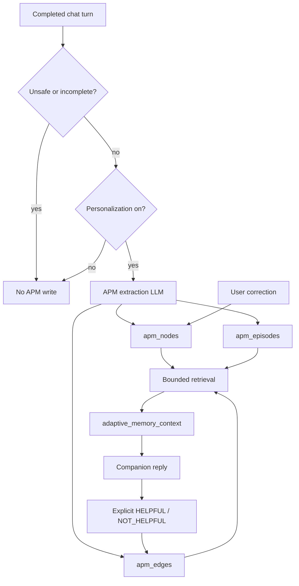

# Adaptive Psychological Memory

Zenark’s Adaptive Psychological Memory (APM) stores **therapeutic structure**,
not chat transcripts. It remembers emotionally weighted associations:
what tended to show up, in what context, how intense it felt, whether it
recurred, what the person tried, and what they **explicitly** said helped.

This is not a clinical system. Labels are user-reported or probabilistic.
They are never diagnoses.

## What APM is

APM is the consent-gated graph in `apm_nodes`, `apm_edges`, `apm_events`,
and `apm_episodes`. It sits beside—not instead of—chat history, Graph RAG,
student facts, and the pattern engine.

Chat history answers “what was said.”
APM answers “what keeps showing up, and what has helped when the person said so.”

## Difference between chat history and APM

| Chat history | APM |
|--------------|-----|
| Encrypted message bodies | Short canonical labels + sealed display labels |
| Session-scoped turns | Cross-session nodes, edges, episodes |
| Always available for the current conversation | Longitudinal use only with personalization consent |
| Raw wording | Associated-with structure (trigger, state, coping, outcome) |

Raw conversation text is **not** copied into APM. Episodes store ids,
hashes, and numeric valence/intensity.

## Episode model

After a completed, safe, consented turn, extraction may write one
`apm_episodes` row (idempotent per user + session + message hash):

- `context` (coarse bucket, e.g. ACADEMIC)
- `trigger_node_id` / `latent_state_node_id` / `intervention_node_id` / `outcome_node_id`
- `valence` (−1..1), `intensity` (0..1)
- `explicitness` (`explicit` | `inferred`)
- `confidence` (evidence quality, not “LLM certainty”)
- `source_reference` (`chat_turn`, session id, content hash)
- `status` (`ACTIVE` | `INVALIDATED`)

## Nodes

`apm_nodes` types: `TRIGGER`, `LATENT_STATE`, `INTERVENTION`, `OUTCOME`,
`CONTEXT`.

Indexed plaintext: `canonical_label`, `aliases`, `user_id`, `node_id`.
Sealed: `display_label`. Scores, counts, and timestamps stay structured
plaintext.

## Edges

Relations: `TRIGGERS`, `EVOLVES_INTO`, `RECOVERED_BY`, `REINFORCES`.

`RECOVERED_BY` is the recovery / coping edge. Explicit HELPFUL /
NOT_HELPFUL updates `explicit_successes` / `explicit_failures` and
`bayesian_score`. Opens, clicks, completions, and return frequency do
**not** count as success.

## Triggers

A trigger is something **associated with** a reported episode (exam,
presentation, argument). The system does not assert causality unless the
person stated it.

## Latent states

Internal descriptors such as overwhelmed or drained. Not diagnoses.
Each node has confidence, recency, occurrence count, and user scope.

## Valence

User-reported or estimated experience on **−1.0 .. +1.0**, stored on
`attributes.valence`. This is not an assistant moral evaluation and not
GDS.

## Intensity

Emotional intensity **0.0 .. 1.0** on `attributes.intensity` (arousal may
fill in when intensity is omitted). Distinct from GDS and from
`risk_intensity_score`.

## Context

Coarse buckets reused from product language: ACADEMIC, FAMILY,
FRIENDSHIP, BULLYING, SLEEP, IDENTITY, SOCIAL_MEDIA, PERFORMANCE,
RELATIONSHIP, SELF_IMAGE, WORK, HEALTH, OTHER.

## Recurrence

`occurrence_count`, `first_seen_at`, `last_seen_at`, temporal buckets.
The same canonical label consolidates. Unrelated labels stay separate.
Duplicate extraction of the same turn does not increment (observation
nonce). Recurrence confidence is `min(1, (count-1)/3)` at read time.

## Intervention

Coping actions the person tried (including in-app practices). Stored as
`INTERVENTION` nodes.

## Outcome

`OUTCOME` observations and explicit feedback events. Crisis language is
excluded from reinforcement.

## Recovery patterns

`LATENT_STATE --RECOVERED_BY--> INTERVENTION` with decayed
`effective_edge_score`. Inferred (no current-turn word match) paths are
`background_only` and cannot mint a card. Eligible cards still require
confidence threshold **and** at least one explicit success.

## Temporal decay

`effective_edge_score` applies relation-specific exponential decay and a
failure penalty. No second decay engine.

## Explicit vs inferred evidence

`source_kind` / episode `explicitness`: `explicit` when the person said
it (or overlap with the current message); otherwise `inferred`. Inferred
recovery never creates an action card.

## Confidence

Node `$max` confidence from extraction; edges use a Bayesian score from
**explicit** successes and failures (priors 2/4). Repeated model
inferences do not mint automatic `RECOVERED_BY` success.

## User correction

Phrases such as “that’s not what happened” or “presentations aren’t
stressful anymore” invalidate overlapping nodes and episodes
(`apply_user_correction`). Invalidated nodes are not revived by inferred
extraction. Current-turn contradiction also suppresses retrieval without
waiting for the write.

## Consent

`users.personalization_consent` via `personalization_enabled`. Off:
no extraction, no retrieval, no feedback writes. Next turn sees the
change. Safety and ordinary chat continue.

## Safety

Crisis classifier, `contains_crisis_signal`, incomplete streams, and
unsafe `SafetyClass` skip extraction. Harmful/diagnostic labels are not
upserted. Crisis turns do not reinforce recovery.

## Encryption

| Field | Storage |
|-------|---------|
| `apm_nodes.display_label` | Sealed `enc::` |
| `canonical_label`, aliases, ids, scores, counts | Indexable plaintext |
| `apm_episodes` | Ids, buckets, numbers, hashes — no transcript |

## Erasure

`apm_nodes`, `apm_edges`, `apm_events`, `apm_episodes` are in
`services.erasure._OWNED`. After erasure, retrieval returns the empty
APM sentence.

## Graph RAG integration

Therapeutic `graph_nodes` remain a separate relationship graph. Bootstrap
can map legacy Trigger/Emotion/CopingTool into background-only APM
below the card threshold. Ordinary Graph RAG for chat is unchanged.

## Proactive-question integration

The proactive engine reads APM associations and recovery paths (reusing
chat context when possible). It does not invent a second memory. Current
denial of a topic suppresses that trigger. Invalidated nodes are skipped.

## Response-shaping lifecycle

```
USER EXPERIENCE
    → episode extraction (consented, safe, complete)
    → nodes / edges / episode
    → later retrieval (bounded, decayed, contradiction-aware)
    → prompt `{adaptive_memory_context}`
    → personalized reply (inform, do not command)
    → explicit HELPFUL / NOT_HELPFUL
    → edge update
    → future retrieval
```

## Example end-to-end

1. “I always get overwhelmed before presentations.”
   → TRIGGER presentation associated with LATENT_STATE overwhelmed,
   CONTEXT ACADEMIC, episode stored.
2. Days later: “I’ve got another presentation tomorrow.”
   → Prompt includes that association. The model may recall gently.
   It must not force a coping tool.
3. “Talking to a friend helped.”
   → `RECOVERED_BY` may exist; HELPFUL increments explicit success.
4. “Presentations aren’t stressful anymore.”
   → Current text wins; APM for that topic is not injected; nodes
   invalidate.

## Architecture



## Known limitations

- Extraction still uses an LLM; tests persist structured `APMExtraction`
  objects rather than live Bedrock.
- Native-language episode labels depend on the extractor.
- `SEEN` / engagement signals are not used as success.
- JITAI outbound remains disabled (`evaluate_jitai_candidate`).
- Not clinically validated. Not production certification.
