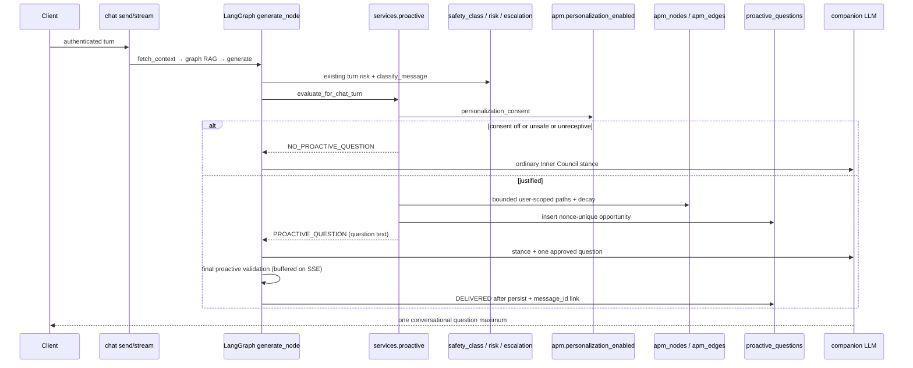

# Proactive Question Engine

Zenark may ask **one** low-pressure follow-up when there is a justified reason
to do so. The default is **no question**. A timer never creates a question.

This is not a clinical system, not a notification bot, and not a second memory
or safety stack. It sits on the existing chat, APM, consent, language, and
Inner Council contracts.

## Architecture

The engine lives in `services/proactive/` and is invoked from:

1. `services/graph.py` `generate_node` (JSON chat send / welcome)
2. `services/streaming.py` (SSE chat stream)
3. `POST /api/v1/proactive/evaluate` (explicit evaluation, no chat injection)

There is **no student push channel**. `evaluate_jitai_candidate` in APM remains
a detect-only stub (`outbound_enabled=False`). This engine does in-conversation
JITAI: if a question is approved during a turn, it is injected into the existing
Inner Council stance block so the companion model asks that single question in
the selected language. Persistence records the opportunity; **DELIVERED** is
set only after the final user-facing reply passes proactive validation **and**
the assistant message is written to `messages` with `delivered_message_id`.

```
Interaction (chat send / stream / evaluate)
    → Eligibility (identity)
    → Safety Gate (existing classifier + risk + escalation)
    → Consent Gate (users.personalization_consent)
    → Receptivity Engine (current-turn language only)
    → Bounded APM / graph retrieval (user-scoped, decayed)
    → Divergence / uncertainty
    → Candidate generator (deterministic Mirror-With-Agency)
    → Inner Council review (deterministic, reuses services.inner_council)
    → Validator (one question, no diagnosis, no internals)
    → Cooldown / idempotency
    → Persist APPROVED or DISPATCHED
    → Chat: inject into stance → companion LLM → FINAL RESPONSE VALIDATION
    → persist assistant message → DELIVERED (only if the final reply passed)
    → User reply → RESPONDED → optional APM CONTEXT/OUTCOME (never auto RECOVERED_BY)
```

## Call graph



Insertion point: **inside generate**, after Inner Council, before
`format_system_prompt`. Streaming mirrors that order. The LangGraph topology
stays `fetch_context → retrieve_graph_context → generate → format_output`.

## Trigger types

These are retrieval/reason labels, **not diagnoses**:

| Type | When it may fire |
|------|------------------|
| `FOLLOW_UP_ON_PREVIOUS_CONTEXT` | Opening turn with a recent owned trigger/context |
| `GRAPH_DIVERGENCE` | Minimizing current talk vs recent owned pattern |
| `PATTERN_CLARIFICATION` | History exists, current turn does not already cover it |
| `RECENT_STRESS_CONTEXT` | Current turn mentions stress and a matching node exists |
| `RECOVERY_CHECK` / `OUTCOME_FOLLOW_UP` | Direct (non-inferred) APM recovery path |
| `ACADEMIC_STRESS_CONTEXT` | Academic-looking node or academic context |
| `SLEEP_CONTEXT` / `HABIT_CONTEXT` / `JOURNAL_CONTEXT` | Matching current-turn language plus that context |

The engine prefers **no question** if the user is already talking about the
same topic (ordinary chat owns that turn).

## Receptivity model

Internal states only: `RECEPTIVE`, `NEUTRAL`, `LOW_RECEPTIVITY`,
`HIGH_OVERLOAD`, `UNKNOWN`.

Used:

- Current message wording (open sharing vs closed “I’m fine” / “ok”)
- Inner Council overload markers (already in `services.inner_council`)
- Presence of journal **context already fetched for the turn** (not a new collector)
- Whether this is an opening turn
- Current APM temporal bucket as **caution only** (late night does not prove distress)

**Unavailable** (not collected, not substituted) — listed in
`UNAVAILABLE_RECEPTIVITY_SIGNALS`:

typing hesitation/speed/rhythm, keystroke content, response delay, app opens,
late-night open counts, return frequency, session duration, message count,
microphone, camera, contacts, location, browser history, background apps.

`services.engagement_guard.reject_engagement_features` still fails closed if
those keys are passed in.

`HIGH_OVERLOAD` and `LOW_RECEPTIVITY` suppress. Empty or opening turns with
history may be `NEUTRAL` / `UNKNOWN` and still allow a follow-up.

## Safety hierarchy

Proactive questioning is subordinate to the existing safety architecture.

1. `classify_message` — any class other than `NONE` suppresses
   (`CRISIS_KEYWORD`, `SELF_HARM`, `VIOLENCE`, `ABUSE`,
   `SEXUAL_EXPLOITATION`, `SEXUAL_CONTENT`, `SUBSTANCE`, `MISCONDUCT`,
   `JAILBREAK`)
2. `contains_crisis_signal` (same APM crisis terms)
3. Inner Council `risk_band == crisis_adjacent`
4. `persistent_distress` (existing risk window / psychiatrist-card path)
5. `risk_intensity >= RISK_HIGH_THRESHOLD` (default 8.0 — **the existing
   product threshold**, not a new 8/10 rule)
6. Open `escalation_cases` (`fast_track_open` / `open`)

Crisis / high-risk turns stay on the existing EOS/care flow. Casual proactive
questions are not generated.

Harmful graph labels (crisis, violence, clinical diagnostic names, etc.) are
dropped during retrieval and never surfaced.

## Consent behavior

`personalization_enabled` (`users.personalization_consent` + active user) is
the gate. No new consent purpose.

If personalization is OFF:

- no APM/graph/journal/profile longitudinal proactive question
- no graph/APM write from a proactive outcome
- ordinary chat still asks its own in-turn questions

Consent changes take effect on the next evaluation.

## Graph RAG retrieval

User id is mandatory on every query.

Budget (configurable, defaults aligned with APM/graph limits):

- `PROACTIVE_GRAPH_NODE_LIMIT` (8)
- `PROACTIVE_GRAPH_PATH_LIMIT` (4)
- `GRAPH_TRAVERSAL_DEPTH` is the platform hop budget; this engine does not
  dump the full subgraph into a prompt
- Lookback: `PROACTIVE_LOOKBACK_DAYS` (60, same order as pattern lookback)

Path preference: recent TRIGGER / CONTEXT → LATENT_STATE → recovery
INTERVENTION/OUTCOME via existing `get_recovery_paths` (direct matches only;
inferred recovery stays background-only, same as APM cards).

If APM is thin, a bounded fallback reads this user’s therapeutic
`graph_nodes` (Trigger / Emotion / Event), opening sealed `name` fields with
`open_text`. Another user’s graph cannot be queried: every filter includes
`user_id`.

Empty graph → `NO_PROACTIVE_QUESTION` (`empty_graph`). History is never invented.

## Divergence detection

If the current text is minimizing (“I’m fine”) **and** a recent owned node
exists, the internal state is `DIVERGENCE_DETECTED` with moderate/low
confidence. The question is tentative. The system does **not** conclude that
the user is distressed.

Compatible current-topic talk is **not** divergence.

Telemetry cannot produce divergence: those signals are not inputs.

## Temporal decay

Reuse APM `effective_edge_score` (exponential decay by relation `decay_rate`
and age). Node recency: `confidence × (1 - age_days / lookback)`. Nodes older
than the lookback window are dropped. A five-month-old pattern does not
compete with yesterday.

## Question generation

Deterministic Mirror-With-Agency templates (no extra LLM call):

**reflect → gently frame → one question**

Age bands reuse the product policy in `prompts.py`: 5–9 concrete, 10–13
clear, 14–17 autonomy-preserving. Low/moderate confidence adds tentative
phrasing (“Correct me if I’m off…”, “I wonder…”).

The chat path asks the companion model to **adapt that one question** into
the selected language/script via the existing `language_instruction`.
Standalone `/evaluate` is a **user-facing localized generation endpoint**:
it reuses `resolve_response_language` and `language_instruction` (not a second
resolver) and returns the `question` in the selected language/script. It does
**not** mark delivery. Public HTTP still omits language internals.

## Inner Council

Four conceptual roles, **zero extra LLM calls**:

| Role | Implementation |
|------|----------------|
| Risk Assessor | Existing `deliberate()` + safety gate |
| Empathy | Reject clinical / interrogative wording |
| Reality Checker | Reject surveillance phrasing and certain-sounding inferences |
| Habit / recovery | Reject “you should / you need to” pressure |

Output is a structured `CouncilDecision`. Failed review → no question
(no unbounded regeneration).

## Validator

Rejects: more than one meaningful question (not only `?` counts), diagnosis,
telemetry/graph internals, pressure, PII fishing, existing `validate_reply`
failures, ROMAN-script native characters. Candidate path has one bounded
soften retry (`PROACTIVE_VALIDATOR_MAX_RETRIES`).

### Final Response Guarantee

Validating the deterministic candidate before the companion model is not
enough. The product contract is that the **final user-facing assistant
response** contains at most one gentle, justified question.

Flow:

1. Pre-generation: validate the source candidate.
2. Companion LLM adapts wording, sentence shape, language, and script.
3. **Final proactive validation** on the generated reply: one question,
   same topic/intent, no extra probes, no diagnosis, no internals, no
   pressure, selected language/script, no contradiction of the approved
   intent.
4. Persist and mark `DELIVERED` only after that pass.

The model does not have to reproduce the candidate word-for-word. It must
preserve the same underlying question, topic, uncertainty, and non-clinical
stance. A rewrite such as “How did your presentation go, and are you still
anxious about it?” is rejected.

On failure: at most `PROACTIVE_FINAL_MAX_RETRIES` (default 1) correction
rewrite, then fall back to an ordinary companion reply **without** the
proactive question. The opportunity is `SUPPRESSED` with a suppression
reason. It is never marked `DELIVERED`.

### Delivery Semantics

`APPROVED` → `DISPATCHED` → final validation pass → assistant row persisted
→ `DELIVERED`.

| Status | Meaning |
|--------|---------|
| `APPROVED` | Opportunity stored. No `delivered_message_id`. `/evaluate` stops here. |
| `DISPATCHED` | Injected into a chat/stream turn. Still no delivery claim. |
| `DELIVERED` | Final validator passed **and** an assistant `messages` row exists. `delivered_message_id` is set. |

A database write alone is not delivery. Delivery is refused when the LLM
ignored the instruction, emitted two questions, diagnosed, leaked
telemetry/graph internals, failed generation, or never showed the approved
question to the client.

Invariant: if `status == DELIVERED`, a corresponding assistant message
exists for the same user, it passed final validation, and it belongs to
this event (`delivered_message_id`).

Outcomes apply only after real delivery. Generated-but-undelivered
questions get no outcome. Delivered-but-unanswered questions are not
success.

### Streaming

Ordinary SSE turns still `astream` tokens immediately.

Proactive turns **buffer**: the complete reply is generated with `ainvoke`,
run through generic `validate_reply` and the proactive final validator, and
only then emitted as `event: token`. Invalid multi-question text is never
sent. Correctness has priority over first-token latency on proactive turns
only.

### Retrieval Reuse

Chat already fetches APM context (`adaptive_memory_context`) and Graph RAG
(`graph_context`) before `generate` / stream generation. The proactive
engine parses those strings first (`hydrate_from_existing_context`). It
runs an extra user-scoped APM or therapeutic-graph query **only when**
those strings cannot supply a usable topic. Existing Graph RAG behavior
for ordinary chat is unchanged. Isolation (authenticated `user_id`,
bounded nodes/paths, lookback, decay, harmful-label drop) is unchanged.

Safe internal metrics (not engagement, not document dumps):
`existing_graph_context_available`, `existing_apm_context_available`,
`proactive_additional_graph_query`, `proactive_additional_apm_query`,
`proactive_retrieval_latency_ms`, total evaluation latency.

### `/evaluate` Language Contract

Standalone `/evaluate` is a **user-facing localized generation endpoint**.
It reuses `resolve_response_language` and `language_instruction` (not a
second resolver). Language comes from `users.preferred_language`. Script
follows the same chat rules: Indian languages default to **ROMAN** on
opening turns and Latin input; native script is selected when the current
message is written in that language's native letters. The returned
`question` matches that resolved language/script. Status remains
`APPROVED`. It never claims the user saw the question, never sets
`DELIVERED`, and does not bypass consent, safety, or cooldown.

Chat dispatch still injects the English source candidate into the stance
so the companion model localizes in-turn; `/evaluate` localizes the
public `question` field itself.

## Cooldown and idempotency

Configurable in `config.config.Settings`:

| Setting | Default |
|---------|---------|
| `PROACTIVE_COOLDOWN_HOURS` | 48 |
| `PROACTIVE_MAX_ATTEMPTS_WINDOW_HOURS` | 168 |
| `PROACTIVE_MAX_ATTEMPTS_PER_WINDOW` | 2 |
| `PROACTIVE_IGNORE_SUPPRESSION_HOURS` | 72 |
| `PROACTIVE_DUPLICATE_LOOKBACK_HOURS` | 72 |
| `PROACTIVE_OPPORTUNITY_TTL_HOURS` | 12 |

`execution_nonce` is `sha256(user_id|trigger_type|topic|cooldown_window)`.
`event_id` is `pq_{owner_namespace}__{nonce}`. Unique indexes on
`(user_id, event_id)` and `(user_id, execution_nonce)` make worker retries
and duplicate API calls idempotent.

## Dispatch and status

Collection: `proactive_questions` (user-scoped). Question text is sealed
(`enc::`) like other user-adjacent narrative.

Statuses: `CANDIDATE_CREATED` (not required on the happy path), `APPROVED`,
`DISPATCHED` (injected into a chat turn), `DELIVERED` (final validation
passed and assistant row persisted with `delivered_message_id`), `SEEN`
(reserved; not claimed from a DB write), `RESPONDED`, `SUPPRESSED`,
`EXPIRED`.

Creating a document is **not** delivery. `/evaluate` leaves status
`APPROVED` until a chat turn dispatches it, it is suppressed, or it expires.

## Outcome learning

User replies can be recorded via `POST /api/v1/proactive/respond` or the next
chat turn after `DELIVERED`.

- Explicit easing/helpfulness → APM `OUTCOME` observation (“user reported
  easing”). **No automatic `RECOVERED_BY` edge.**
- Clarifying reply → APM `CONTEXT` stub label, not the raw message
- Ignore / “ok” → suppression window, no success
- Crisis language → `crisis_excluded`, no reinforcement
- Message opens / returns are not success signals (not collected)

## Privacy boundaries

- No new telemetry collectors
- No raw telemetry stored on the opportunity document
- Graph ids, confidence, risk internals, and council deliberation are **not**
  on public API responses
- Logs use `hash_user_id`, request id, decision, trigger type, suppression
  reason, latency, event id, status — not question bodies, journals, or graph
  documents
- Erasure: `proactive_questions` is in `services.erasure._OWNED`

## Observability

Allowlisted metrics: `proactive_decision`, `proactive_trigger_type`,
`proactive_suppression`, `proactive_status`, `proactive_validation`,
`proactive_retry`.

In-process counters (tests / process): candidates evaluated/suppressed,
questions approved/dispatched/responded/expired, duplicate attempts,
validation rejections, safety suppression.

Success is **not** optimized for opens, session length, or message count.

## APIs

Mounted at `/api` and `/api/v1`:

- `POST /proactive/evaluate`
- `GET /proactive/pending`
- `POST /proactive/respond`

Auth: bearer token. Optional body `user_id` must match the token.

Public evaluate body:

```json
{ "decision": "PROACTIVE_QUESTION", "event_id": "...", "question": "..." }
```

or

```json
{ "decision": "NO_PROACTIVE_QUESTION", "reason": "low_receptivity" }
```

## Failure behavior

Evaluation is fail-open for **chat**: exceptions log and the turn continues
without a proactive question. Mongo unique conflicts return the existing
event instead of sending a second question. Expired `APPROVED`/`DISPATCHED`
rows become `EXPIRED` and are not pending.

## Examples

Good:

> I remember that presentation was weighing on you a bit.
> How did it end up feeling — eased up a little, or still sitting with you?

Bad (not generated):

- “You’ve been opening the app at 2 AM…” (telemetry)
- “Are you anxious? What happened? Why?” (multi-question, diagnostic)
- “Your graph shows this trigger caused anxiety.” (internals)

## Known limitations

- No durable outbound push/scheduler. Pending questions wait for a turn or
  `GET /pending`.
- Standalone `/evaluate` localizes through the existing language prompt
  contract. Chat/stream still localize the companion reply in-turn.
- `SEEN` is not inferred from client telemetry (none is allowed).
- Receptivity cannot use typing or app-open signals; those remain unavailable.
- Not clinically validated. Not production-readiness certification.
