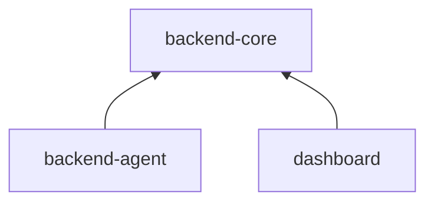

# Zenark Repository Architecture

The git root is `C:\company\chat\mental_health`. The three applications are directories in that repository. They are not three copies of the old monolith.

backend-agent and backend-core are also published as their own Git repositories. This repository remains the combined checkpoint. The dashboard stays here until a separate destination is provided.

- https://github.com/Zenark-2025/backend-agent
- https://github.com/Zenark-2025/backend-core

Those repositories were cut with `git subtree split`. Their history starts at this checkpoint, because `backend-agent/` and `backend-core/` did not exist as paths before the move. Older history of the same files remains in this repository.

## Applications

### backend-agent

Purpose: mental-health companion and Exam Buddy.

Owned domains: Zen chat and streaming, voice, safety, crisis handling, EOS, GDS, APM, psychological profile, patterns, therapeutic graph, student memory, proactive questions, meditation, journaling, mood, sleep, habits, tasks, consultation, language, Exam Buddy and its guardrails.

Entrypoint: `backend-agent/app.py` (`create_app` in `backend-agent/api/application.py`).

Port: 8000.

Dependencies: the `zenark-backend-core` package. Inside this repository, `backend-agent/run.py` adds the sibling `backend-core` directory when that directory contains `pyproject.toml`. The published backend-agent repository installs a pinned commit of https://github.com/Zenark-2025/backend-core instead. MongoDB, Bedrock, Sarvam, encryption, and JWT settings still come from the environment.

```powershell
cd C:\company\chat\mental_health\backend-agent
python run.py
```

### backend-core

Purpose: shared Python platform package (`zenark-backend-core`). backend-agent and the dashboard import it. They do not call it over HTTP.

It holds configuration, the Mongo client, middleware, request IDs, error envelopes, encryption, user accounts, academic mark reads, school tenancy, and the Bedrock client.

Owned domains: no mental-health product behavior and no dashboard product behavior. Login HTTP routes stay on backend-agent so existing clients keep one host. The functions those routes call live here.

`core_app.py` can run alone for process probes. That process is not required for chat or the dashboard.

Entrypoint: `backend-core/core_app.py`.

Port: 8001 when the probe process is started. The product API does not use this port.

Dependencies: none of the other applications.

```powershell
cd C:\company\chat\mental_health\backend-core
python run.py
```

### dashboard

Purpose: school and admin dashboard.

Owned domains: dashboard routes, repositories, services, schemas, metrics, and dashboard-owned collections.

Entrypoint: `dashboard/dashboard_app.py`.

Port: 8002.

Dependencies: `backend-core` on `PYTHONPATH`. It does not import mental-health services, APM, the therapeutic graph, or Exam Buddy.

```powershell
cd C:\company\chat\mental_health\dashboard
python run.py
```

## Dependency Direction



backend-agent does not import the dashboard package. backend-core does not import backend-agent or the dashboard. The dashboard does not import backend-agent.

`app.py` at the repository root is a local compatibility composer. `python run.py` from the root still serves mental-health routes and `/api/v1/dashboard` in one process, by mounting the dashboard router on the agent application. Staging does not use that composer.

## Route Ownership

backend-agent owns the historical API, including `/chat/*`, `/voice/*`, `/ws/psychiatrist-voice`, `/auth/*`, `/api/*`, `/api/v1/*` except the dashboard, and `/health`.

dashboard owns `/api/v1/dashboard/*`.

backend-core owns no product route. Each process also exposes `/health/live` and `/health/ready` for its own orchestrator. The public gateway sends those paths to backend-agent, so the historical health payload is unchanged.

The full table is `docs/API_OWNERSHIP_MATRIX.md`.

## Collection Ownership

The database is still one Mongo database. Folder boundaries are not database boundaries.

| Collection | Owner | Read by | Written by |
|---|---|---|---|
| users | backend-core | agent, dashboard | agent via backend-core |
| marks | backend-core | agent, dashboard | school portal, not this service |
| messages | backend-agent | backend-agent | backend-agent |
| graph_nodes, graph_relationships | backend-agent | backend-agent | backend-agent |
| apm_nodes, apm_edges | backend-agent | backend-agent | backend-agent |
| student_psychological_profiles | backend-agent | backend-agent, dashboard read-only | backend-agent |
| student_memories | backend-agent | backend-agent | backend-agent |
| user_patterns, pattern_evidence | backend-agent | backend-agent, dashboard read-only | backend-agent |
| user_risk_turns | backend-agent | backend-agent, dashboard read-only | backend-agent |
| mood_logs, habit_events | backend-agent | backend-agent, dashboard read-only for mood | backend-agent |
| sleep_logs | backend-agent | backend-agent, dashboard read-only | backend-agent |
| journal_entries | backend-agent | backend-agent | backend-agent |
| meditation_executions, meditation_offers, meditation_metadata_promotions | backend-agent | backend-agent, dashboard read-only for executions | backend-agent |
| session_reports, daily_tasks | backend-agent | backend-agent | backend-agent |
| proactive_questions | backend-agent | backend-agent | backend-agent |
| consent_grants, erasure_jobs | backend-agent | backend-agent | backend-agent |
| escalation_cases, escalation_events | backend-agent | backend-agent | backend-agent |
| gds_mapping_versions, gds_snapshots | backend-agent | backend-agent | backend-agent |
| stepping_outcomes | backend-agent | backend-agent | backend-agent |
| psychiatric_evaluations, consultation_notifications, psychiatric_evaluation_audit | backend-agent | backend-agent | backend-agent |
| exam_buddy_nodes, exam_buddy_relationships | backend-agent | backend-agent | backend-agent |
| dashboard_interventions, dashboard_notifications, dashboard_reports, dashboard_settings, dashboard_audit, dashboard_teacher_actions | dashboard | dashboard | dashboard |

The dashboard read of mood, sleep, patterns, risk turns, meditation executions, and attendance on the psychological profile is an intentional read-only coupling. Those queries already existed. The dashboard does not import the services that own them, and its writes are limited to `dashboard_*` collections. Replacing the reads with an HTTP API is deferred. Owner and school checks still run in the dashboard dependencies before those reads.

## Shared Infrastructure

One implementation, in backend-core:

- `config` settings and logger
- `database` / `db` Mongo client
- `core` middleware, request IDs, error envelopes, rate limit, runtime secret guard
- `backend_core.security` encryption and anonymization
- `backend_core.users` accounts and token verification
- `backend_core.deps` bearer authentication dependency
- `backend_core.tenancy` school tenant key
- `backend_core.marks` academic mark reads
- `llm_provider` Bedrock client

## Environment Configuration

`.env`, `.env.staging.local`, and other secret files stay at the repository root and stay gitignored. In this repository, settings load `.env` from that root. A standalone backend-core checkout loads `.env` from its own root. The choice is the presence of `docker-compose.staging.yml` next to `backend-agent/`, which only this combined repository has.

The settings object is still one schema. Splitting it would change defaults and the staging secret guard. Each process therefore parses the full environment. Unused provider keys are not required for a process to boot in development. Staging still refuses the placeholder encryption key, the placeholder auth secret, and the shared default database name.

## Docker

Inside this repository the build context is the repository root so images can see `backend-core` without copying secrets. The published repositories have their own Dockerfiles that build from those repository roots. Those images have not been built here. The Docker engine was not running.

```powershell
docker build -f backend-agent/Dockerfile -t zenark-agent .
docker build -f backend-core/Dockerfile -t zenark-core .
docker build -f dashboard/Dockerfile -t zenark-dashboard .
```

`.dockerignore` excludes `.env`, `.env.*`, `.git`, `.venv`, tests, and meditation audio. The root `Dockerfile` matches the agent image so `docker build .` still builds the API.

## Local Development

Single process, previous command, mental-health routes and the dashboard together:

```powershell
cd C:\company\chat\mental_health
python run.py
```

Separate processes use the three `run.py` files above. Set `PYTHONPATH` only if you start uvicorn yourself. The `run.py` files set it.

## Testing

```powershell
cd C:\company\chat\mental_health
python -m pytest -q
```

That runs agent tests, Exam Buddy tests, core tests, and dashboard tests. Architecture tests reject imports that cross the boundary the wrong way.

## Deployment

Staging compose file: `docker-compose.staging.yml`.

```powershell
docker compose --env-file .env.staging.local -f docker-compose.staging.yml up --build
```

Services: `mongo` (no host port), `api` (`zenark-staging-api`), `core` (`zenark-staging-core`), `dashboard` (`zenark-staging-dashboard`), `gateway` (`zenark-staging-gateway` on host port 8000).

Mongo is not published to the host. The gateway is the only published HTTP port.

## Rules

- The dashboard does not import agent internals.
- backend-core does not depend on agent domain modules.
- Each product route has one owner.
- Sensitive domain modules have one owner. APM, graph, EOS, safety, and Exam Buddy stay in backend-agent.
- Encryption, JWT verification, request IDs, and error sanitization have one implementation.
- No production secrets in git.
- The dashboard does not import psychological service internals. Its existing read-only collection queries stay as they are.
